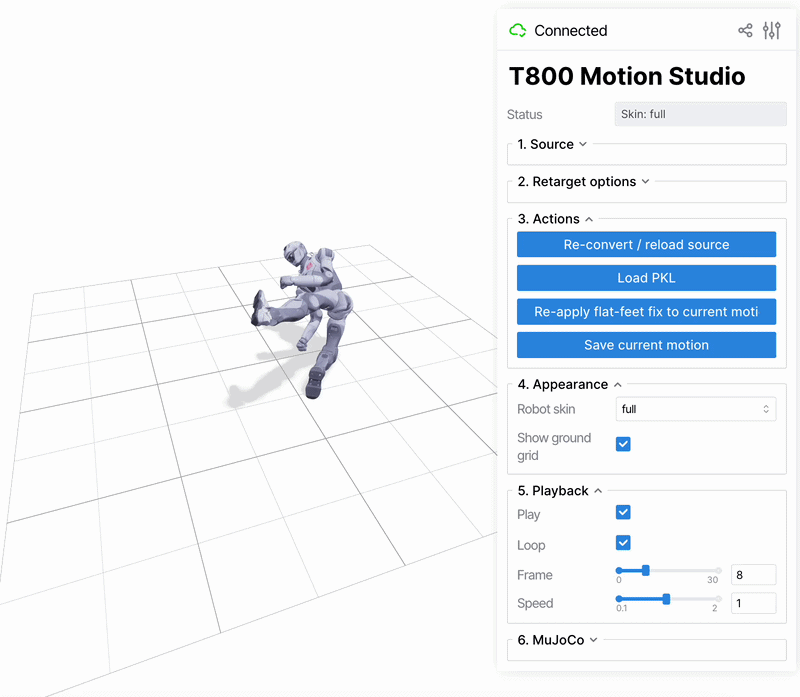

# T800 FBX Studio



**FBX / BVH → EngineAI T800 `.pkl`** with in-browser 3D preview (viser).

First open-source pipeline for **Mixamo/FBX motion → T800 robot** retargeting with flat feet and web preview. No desktop MuJoCo window required.

## Quick start

```bash
git clone https://github.com/nbamylife7-bot/t800-fbx-studio.git
cd t800-fbx-studio

chmod +x install.sh run.sh scripts/*.sh
./install.sh          # conda env + Python deps
./run.sh              # http://localhost:8080
```

1. Open **http://localhost:8080**
2. In **1. Source**, set **Input type** (`fbx` / `bvh` / `pkl`) or pick a **Demo clip**
3. Upload a file or set a path — convert/load runs automatically
4. Play in the browser; output `.pkl` files are saved under `data/out/`

## Supported inputs

All three formats work in the web UI:

| Format | Supported | FBX SDK required? | Notes |
|--------|-----------|-------------------|-------|
| `.fbx` | **Yes** | **Yes** | Mixamo / OptiTrack; root joint `Hips` |
| `.bvh` | **Yes** | No | LaFAN1 / `human_robot_hit` — works after `./install.sh` |
| `.pkl` | **Yes** | No | T800 motion; demo clips in `examples/demos/` |

> **FBX SDK required?** means whether the Autodesk SDK is needed. **No** = works without `import fbx`.

**Try without FBX:** Demo clip → `Boxing` / `Martelo_2` / `Flair`, or upload `examples/sample_human_robot_hit.bvh` with Input type = `bvh`.

## Flat feet on ground

In **2. Retarget options**, toggle **Flat feet on ground** (off by default).

If the retargeted motion looks wrong — the robot stands on tiptoes, feet float above the floor, or the pose feels stiff — try turning this option **on** or **off**, then click **Re-convert / reload source**. Kicks, walks, and different sources (FBX vs BVH) often need different settings.

## FBX SDK (only for `.fbx`)

### Fast path — prebuilt wheel (macOS Apple Silicon, Python 3.10)

Bundled in this repo — **no compile step**:

```bash
./install.sh
./scripts/install_fbx_sdk.sh    # installs vendor/fbx_wheels/*.whl
python -c "import fbx; print('ok')"
```

See `vendor/fbx_wheels/README.md` (Autodesk license applies).

### Build from sources (Linux, Intel Mac, other Python versions)

Official download page (scroll to **Past FBX SDK downloads → 2020.3.7**):

https://aps.autodesk.com/developer/overview/fbx-sdk

**Automated:**

```bash
./scripts/download_fbx_sdk.sh
source .fbx_sdk_cache/paths.env
./scripts/install_fbx_sdk.sh
```

Verified direct download URLs:

| Platform | C++ SDK | Python bindings |
|----------|---------|-----------------|
| **macOS** | [fbx202037_fbxsdk_clang_mac.pkg.tgz](https://damassets.autodesk.net/content/dam/autodesk/www/files/fbx202037_fbxsdk_clang_mac.pkg.tgz) | [fbx202037_fbxpythonbindings_mac.pkg.tgz](https://damassets.autodesk.net/content/dam/autodesk/www/files/fbx202037_fbxpythonbindings_mac.pkg.tgz) |
| **Linux** | [fbx202037_fbxsdk_gcc_linux.tar.gz](https://damassets.autodesk.net/content/dam/autodesk/www/files/fbx202037_fbxsdk_gcc_linux.tar.gz) | [fbx202037_fbxpythonbindings_linux.tar.gz](https://damassets.autodesk.net/content/dam/autodesk/www/files/fbx202037_fbxpythonbindings_linux.tar.gz) |

> The old URL `autodesk.com/developer-network/platform-technologies/fbx-sdk-2020-3-7` returns **404**. Use the APS page or the direct links above.

**Manual macOS extract:**

```bash
mkdir -p .fbx_sdk_cache && cd .fbx_sdk_cache
curl -L -O "https://damassets.autodesk.net/content/dam/autodesk/www/files/fbx202037_fbxsdk_clang_mac.pkg.tgz"
curl -L -O "https://damassets.autodesk.net/content/dam/autodesk/www/files/fbx202037_fbxpythonbindings_mac.pkg.tgz"
tar -xzf fbx202037_fbxsdk_clang_mac.pkg.tgz
tar -xzf fbx202037_fbxpythonbindings_mac.pkg.tgz
pkgutil --expand-full fbx202037_fbxsdk_clang_macos.pkg sdk_expanded
pkgutil --expand-full fbx202037_fbxpythonbindings_macos.pkg bindings_expanded
export FBXSDK_ROOT="$PWD/sdk_expanded/Root.pkg/Payload/Applications/Autodesk/FBX SDK/2020.3.7"
export FBX_BINDINGS_DIR="$PWD/bindings_expanded/Root.pkg/Payload/Applications/Autodesk/FBXPythonBindings"
cd ..
./scripts/install_fbx_sdk.sh
```

Verify:

```bash
conda activate t800-studio
python -c "import fbx; print('ok')"
```

Full FBX→PKL smoke test:

```bash
export T800_TEST_FBX="/path/to/your/motion.fbx"
conda activate t800-studio
PYTHONPATH=".:gmr:gmr/third_party" python scripts/verify_setup.py
```

One-shot download + build:

```bash
T800_AUTO_DOWNLOAD_FBX=1 ./install.sh
```

## Repo layout

```
t800-fbx-studio/
  app/                # viser web UI
  gmr/                # bundled retarget backend + T800 assets (~100 MB)
  vendor/fbx_wheels/  # prebuilt fbx wheel (macOS arm64, Python 3.10)
  examples/           # demo .pkl + sample .bvh
  docs/               # README assets (studio-demo.gif)
  scripts/
  data/out/           # converted PKL (gitignored)
  install.sh
  run.sh
```

## Requirements

- macOS or Linux (Windows untested)
- Miniconda, **Python 3.10**
- ~4 GB RAM for retargeting
- FBX: prebuilt wheel (macOS arm64) or build from Autodesk FBX SDK 2020.3.7
- See `requirements-web.txt`

## Credits

Built on [GMR](https://github.com/YanjieZe/GMR) retargeting patterns, extended for **EngineAI T800** with custom FBX IK (`fbx_to_t800.json`), foot flattening, and viser preview.

FBX install flow follows [ASE poselib](https://github.com/nv-tlabs/ASE/tree/main/ase/poselib#importing-from-fbx).

## License

MIT — see [LICENSE](LICENSE). T800 mesh/texture assets: use under your EngineAI / project terms.

---

# T800 FBX Studio（中文）

**FBX / BVH → EngineAI T800 `.pkl`**，浏览器内 3D 预览（viser）。

首个开源 **Mixamo/FBX 动作 → T800 机器人** 重定向流程，支持脚部贴地与 Web 预览。无需桌面 MuJoCo 窗口。

## 快速开始

```bash
git clone https://github.com/nbamylife7-bot/t800-fbx-studio.git
cd t800-fbx-studio

chmod +x install.sh run.sh scripts/*.sh
./install.sh          # 创建 conda 环境并安装依赖
./run.sh              # http://localhost:8080
```

1. 打开 **http://localhost:8080**
2. 在 **1. Source** 中选择 **Input type**（`fbx` / `bvh` / `pkl`）或选择 **Demo clip**
3. 上传文件或填写路径 — 自动转换/加载
4. 在浏览器中播放；输出的 `.pkl` 保存在 `data/out/`

## 支持的输入格式

三种格式均可在 Web UI 中使用：

| 格式 | 是否支持 | 需要 FBX SDK？ | 说明 |
|------|----------|----------------|------|
| `.fbx` | **是** | **是** | Mixamo / OptiTrack；根骨骼 `Hips` |
| `.bvh` | **是** | 否 | LaFAN1 / `human_robot_hit` — `./install.sh` 后即可使用 |
| `.pkl` | **是** | 否 | T800 动作；示例见 `examples/demos/` |

> **需要 FBX SDK？** 表示是否需要安装 Autodesk SDK。**否** = 无需 `import fbx` 即可使用。

**无需 FBX 即可试用：** Demo clip → `Boxing` / `Martelo_2` / `Flair`，或上传 `examples/sample_human_robot_hit.bvh`（Input type = `bvh`）。

## 脚部贴地（Flat feet on ground）

在 **2. Retarget options** 中切换 **Flat feet on ground**（默认关闭）。

若重定向后的动作不正常 — 机器人踮脚、脚悬空或姿态僵硬 — 请尝试**开启或关闭**该选项，然后点击 **Re-convert / reload source**。踢腿、行走以及不同来源（FBX / BVH）往往需要不同设置。

## FBX SDK（仅 `.fbx` 需要）

### 快捷方式 — 预编译 wheel（macOS Apple Silicon，Python 3.10）

仓库内已包含 — **无需编译**：

```bash
./install.sh
./scripts/install_fbx_sdk.sh    # 安装 vendor/fbx_wheels/*.whl
python -c "import fbx; print('ok')"
```

详见 `vendor/fbx_wheels/README.md`（须遵守 Autodesk 许可）。

### 从源码构建（Linux、Intel Mac、其他 Python 版本）

官方下载页（滚动至 **Past FBX SDK downloads → 2020.3.7**）：

https://aps.autodesk.com/developer/overview/fbx-sdk

**自动下载：**

```bash
./scripts/download_fbx_sdk.sh
source .fbx_sdk_cache/paths.env
./scripts/install_fbx_sdk.sh
```

已验证的直接下载链接：

| 平台 | C++ SDK | Python 绑定 |
|------|---------|-------------|
| **macOS** | [fbx202037_fbxsdk_clang_mac.pkg.tgz](https://damassets.autodesk.net/content/dam/autodesk/www/files/fbx202037_fbxsdk_clang_mac.pkg.tgz) | [fbx202037_fbxpythonbindings_mac.pkg.tgz](https://damassets.autodesk.net/content/dam/autodesk/www/files/fbx202037_fbxpythonbindings_mac.pkg.tgz) |
| **Linux** | [fbx202037_fbxsdk_gcc_linux.tar.gz](https://damassets.autodesk.net/content/dam/autodesk/www/files/fbx202037_fbxsdk_gcc_linux.tar.gz) | [fbx202037_fbxpythonbindings_linux.tar.gz](https://damassets.autodesk.net/content/dam/autodesk/www/files/fbx202037_fbxpythonbindings_linux.tar.gz) |

> 旧链接 `autodesk.com/developer-network/platform-technologies/fbx-sdk-2020-3-7` 已 **404**。请使用 APS 页面或上方直链。

**macOS 手动解压：**

```bash
mkdir -p .fbx_sdk_cache && cd .fbx_sdk_cache
curl -L -O "https://damassets.autodesk.net/content/dam/autodesk/www/files/fbx202037_fbxsdk_clang_mac.pkg.tgz"
curl -L -O "https://damassets.autodesk.net/content/dam/autodesk/www/files/fbx202037_fbxpythonbindings_mac.pkg.tgz"
tar -xzf fbx202037_fbxsdk_clang_mac.pkg.tgz
tar -xzf fbx202037_fbxpythonbindings_mac.pkg.tgz
pkgutil --expand-full fbx202037_fbxsdk_clang_macos.pkg sdk_expanded
pkgutil --expand-full fbx202037_fbxpythonbindings_macos.pkg bindings_expanded
export FBXSDK_ROOT="$PWD/sdk_expanded/Root.pkg/Payload/Applications/Autodesk/FBX SDK/2020.3.7"
export FBX_BINDINGS_DIR="$PWD/bindings_expanded/Root.pkg/Payload/Applications/Autodesk/FBXPythonBindings"
cd ..
./scripts/install_fbx_sdk.sh
```

验证：

```bash
conda activate t800-studio
python -c "import fbx; print('ok')"
```

完整 FBX→PKL 冒烟测试：

```bash
export T800_TEST_FBX="/path/to/your/motion.fbx"
conda activate t800-studio
PYTHONPATH=".:gmr:gmr/third_party" python scripts/verify_setup.py
```

一键下载并构建：

```bash
T800_AUTO_DOWNLOAD_FBX=1 ./install.sh
```

## 仓库结构

```
t800-fbx-studio/
  app/                # viser Web UI
  gmr/                # 重定向后端 + T800 资源（约 100 MB）
  vendor/fbx_wheels/  # 预编译 fbx wheel（macOS arm64，Python 3.10）
  examples/           # 示例 .pkl 与 .bvh
  docs/               # README 资源（studio-demo.gif）
  scripts/
  data/out/           # 转换输出（git 忽略）
  install.sh
  run.sh
```

## 系统要求

- macOS 或 Linux（Windows 未测试）
- Miniconda，**Python 3.10**
- 重定向约需 **4 GB** 内存
- FBX：预编译 wheel（macOS arm64）或从 Autodesk FBX SDK 2020.3.7 构建
- 见 `requirements-web.txt`

## 致谢

基于 [GMR](https://github.com/YanjieZe/GMR) 重定向方案，针对 **EngineAI T800** 扩展：自定义 FBX IK（`fbx_to_t800.json`）、脚部贴地与 viser 预览。

FBX 安装流程参考 [ASE poselib](https://github.com/nv-tlabs/ASE/tree/main/ase/poselib#importing-from-fbx)。

## 许可证

MIT — 见 [LICENSE](LICENSE)。T800 网格/贴图资源：请按 EngineAI / 项目条款使用。
